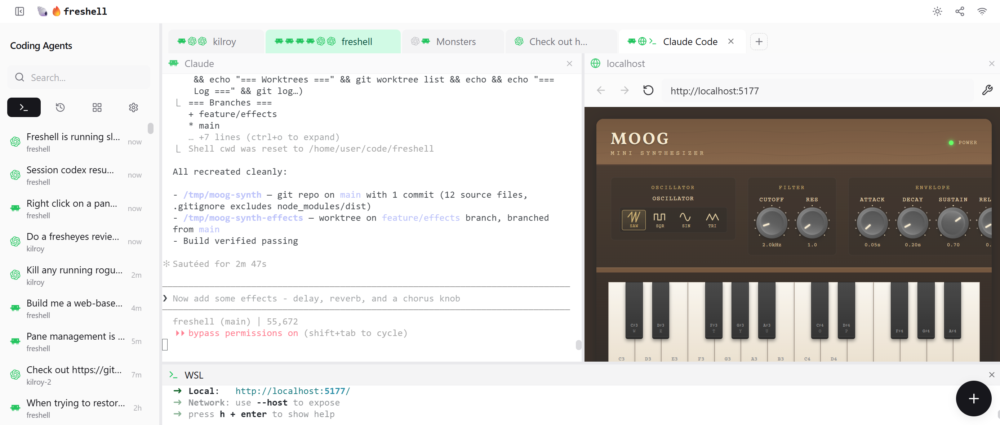

<p align="center">
  
  
  
</p>

<h1 align="center">🐚🔥freshell</h1>

<p align="center">
  Claudes Code, Codex, shells, and editors in joyful harmony. Speak with the dead, jump to your phone, and more.
</p>

<p align="center">
  <strong>CLIs in tabs and panes | Forever coding agent history | What if tmux and Claude fell in love?</strong>
</p>

---



## Features

- **Tabs and panes** — Organize projects with multiple coding agents, shells, browsers, editors, and more on a tab - and as many tabs as you want.
- **Desktop, laptop, phone** — Run on your main machine, then work on your project anywhere via VPN or Tailscale.
- **Speak with the dead** — Resume any Claude, Codex, or OpenCode session from any device (even if you weren't using freshell to run it)
- **Fancy tabs** — Auto-name from terminal content, drag-and-drop reorder, and per-pane type icons so you know what's in each tab
- **TUI Optional** — Use Claude Code, Codex, and OpenCode without living inside their terminal UIs. Freshell's browser panes get rid of ASCII box-drawing noise and add instant scrolling, typography choices, collapsible tool output, preserved history, and more.
- **Self-configuring workspace** — Just ask Claude or Codex to open a browser in a pane, or create a tab with four subagents. Built-in tmux-like API and skill makes it simple.
- **Headers that tell you what's up** — AI naming, branch, tokens left, active directory, and more in every pane title bar, updating live as you work.
- **Activity notifications** — They boop when they're ready for you, optionally.

## Quick Start

```bash
# Clone the repository at the latest stable release
git clone --branch v0.7.0 https://github.com/danshapiro/freshell.git
cd freshell

# Install dependencies
npm install

# Build and run
npm run serve
```

On first run, freshell auto-generates a `.env` file with a secure random `AUTH_TOKEN`. The token is printed to the console at startup — open the URL shown to connect.

## Contributing

Contributions are welcome. Start from `origin/main` in a worktree, submit a Pull Request against `main`, and keep behavior changes on PR branches. After a PR merges, update local `main` from `origin/main`. See [docs/development/branch-model.md](docs/development/branch-model.md).

## Community Projects

Projects built by the community around freshell.

- [freshell-container](https://github.com/nkcx/freshell-container) — Docker container packaging freshell with all supported coding CLI providers for self-hosted, multi-device access

## License

MIT License — see [LICENSE](LICENSE) for details.

---

<p align="center">
  Made with terminals and caffeine
</p>
