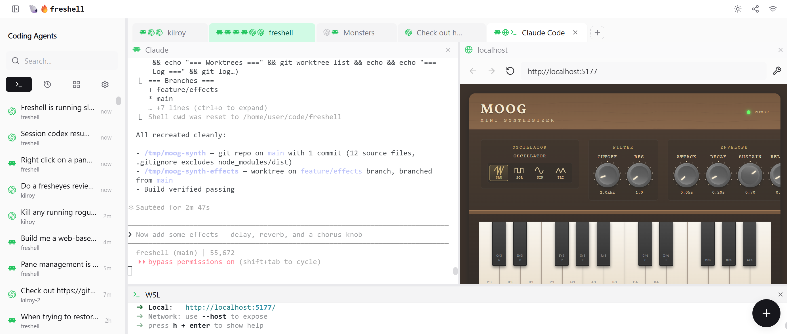

<p align="center">
  
  
  
</p>

<h1 align="center">🐚🔥freshell</h1>

<p align="center">
  Claudes Code, Codex, shells, and editors in joyful harmony. Speak with the dead, jump to your phone, and more.
</p>

<p align="center">
  <strong>CLIs in tabs and panes | Forever coding agent history | What if tmux and Claude fell in love?</strong>
</p>

---



## Features

- **Tabs and panes** — Organize projects with multiple coding agents, shells, browsers, editors, and more on a tab - and as many tabs as you want.
- **Desktop, laptop, phone** — Run on your main machine, then work on your project anywhere via VPN or Tailscale.
- **Speak with the dead** — Resume any Claude, Codex, or OpenCode session from any device (even if you weren't using freshell to run it)
- **Fancy tabs** — Auto-name from terminal content, drag-and-drop reorder, and per-pane type icons so you know what's in each tab
- **Freshclaude** — An interactive alternative to Claude CLI that works with your Anthropic subscription. Rich chat UI with collapsible tool strips, token budget display, and full session persistence.
- **Extension system** — Add CLI integrations via manifest-based extensions. Client and server-hosted extension panes are not supported by the Rust server.
- **Self-configuring workspace** — Just ask Claude or Codex to open a browser in a pane, or create a tab with four subagents. Built-in tmux-like API and skill makes it simple.
- **Live pane headers** — See your active directory, git branch, and context usage in every pane title bar, updating live as you work. Fresh-agent panes carry their context meter in their status strip instead of the header.
- **Host pressure dashboard pane** — CPU, memory, pressure, and I/O at a glance with near-zero overhead (metrics stream only while you're watching). Linux, WSL, and macOS only — not shown on Windows.
- **Activity notifications** — Configurable attention indicators (highlight, pulse, darken) on tabs and pane headers when a coding CLI finishes its turn, with click or type dismiss modes
- **AI-powered session titles** — Right-click any session and generate a Gemini-powered title based on conversation content
- **Progressive sidebar search** — Two-phase search with instant local results followed by deep server-side content search
- **Mobile responsive** — Auto-collapsing sidebar and overlay navigation for phones and tablets
- **Stream Deck** — Drive freshell from an Elgato Stream Deck: tabs on keys with repo icons and status backgrounds (or classic live previews and status rings), press to focus, long-press to approve or stop agents. See [Stream Deck](#stream-deck).

## Quick Start

```bash
# Clone the repository at the latest stable release
git clone --branch v0.7.5 https://github.com/danshapiro/freshell.git
cd freshell

# Install dependencies
npm install

# Build the client, tools, and Rust server, then run it
npm run serve
```

On first run, `npm run serve`, `npm run dev`, `npm run dev:server`, and the
Rust launcher create a private `.env` file with a secure random `AUTH_TOKEN` if
one is not already supplied. Existing environment variables and `.env` values
are preserved. The Rust server prints the URL at startup — open it to connect.

For a development checkout, use `npm run dev` for Vite plus the Rust server,
or `PORT=3499 npm run dev:server` for the Rust server without Vite. For a
previously built checkout, `scripts/launch-rust.sh --port 3499` builds and
starts an isolated Rust instance; use a port other than the live self-hosted
port when testing a worktree.

## Prerequisites

Node.js 22.5+ and Rust stable are required. Node is used for the client,
standalone CLI/MCP tools, and Electron build; the Rust toolchain builds the
`freshell-server` binary and owns PTY support. Platform-specific build tools
are documented in [Building the Windows Electron App](docs/development/windows-electron-build.md).

> **Note:** On native Windows, terminals default to WSL. Set `WINDOWS_SHELL=cmd` or `WINDOWS_SHELL=powershell` to use a native Windows shell instead.

## Usage

```bash
npm run dev     # Vite + Rust server with hot reload
npm run serve   # Build and run the Rust server
```

`npm run serve` is intended for `main`. If you run it from another branch, Freshell asks for confirmation in an interactive terminal and refuses in non-interactive shells unless `FRESHELL_ALLOW_NON_MAIN_SERVE=1` is set.

For unattended operation, build `freshell-server` and install the optional
user service in [`installers/systemd/freshell-rust.service`](installers/systemd/freshell-rust.service).
The service is standalone and independent of Electron.

## Stream Deck

Freshell can drive an Elgato Stream Deck straight from the browser. Each key shows a tab — by default the **Status icons** style: title on top, centered repo icons, and a status background (green for tabs that want attention), with keys sorted so attention-seeking tabs come first. Press a key to focus that tab; long-press (500 ms) to open an action layer with BACK / APPROVE / STOP keys (it closes itself after 10 s). When you have more tabs than keys, the last key pages through them (wrapping around). On a Stream Deck +, the dials cycle tabs and flip pages and the touch strip shows the active tab plus busy/waiting counts (waiting = tabs that finished a turn or are waiting for approval). The deck dims after a configurable idle timeout and wakes on activity.

**Requirements**

- Chrome or Edge (WebHID). Not supported in the freshell desktop app — use Chrome or Edge instead.
- An Elgato Stream Deck. The Stream Deck Mini is the primary target; other models (including the Stream Deck + dials and touch strip) are driven by their reported capabilities.

**Connecting:** Settings → Stream Deck → turn on **Enable Stream Deck**, click **Connect Stream Deck**, and pick the device in the browser prompt. After that first grant, freshell reconnects automatically — including after unplug/replug and page reloads. Deck settings are stored in the browser (localStorage), so they are per browser profile, not per freshell server.

**Virtual deck:** Settings → Stream Deck → **Show virtual deck** opens an on-screen deck panel that mirrors the keys. It works without any hardware — and in browsers without WebHID.

**Tile style:** Settings → Stream Deck → **Tile style** switches between **Status icons** (the default, described above) and **Terminal previews** — the classic look with a title banner, a live mini terminal preview on each key, and colored status rings (blue busy, green needs-attention, amber waiting for approval), with keys in plain tab-bar order. Switching takes effect immediately, on the hardware deck and the virtual deck alike.

**Linux device permissions (udev):** hidraw device nodes default to root-only, so the browser cannot open the deck until you grant access to the Elgato vendor id (`0fd9`):

```bash
sudo tee /etc/udev/rules.d/50-elgato-stream-deck.rules >/dev/null <<'EOF'
SUBSYSTEM=="usb", ATTRS{idVendor}=="0fd9", TAG+="uaccess"
KERNEL=="hidraw*", ATTRS{idVendor}=="0fd9", TAG+="uaccess"
EOF
sudo udevadm control --reload-rules && sudo udevadm trigger
```

Then unplug and replug the deck. Without the rule, the connection status shows "In use by another window or app — or missing device permissions (Linux udev)" — the browser cannot distinguish the two failure causes.

**Chrome Memory Saver:** Chrome's Memory Saver can discard a long-hidden freshell tab even while the deck is connected — the deck goes dark until you revisit the tab. To avoid this, add your freshell URL to Memory Saver's "Always keep this site active" list (`chrome://settings/performance`).

## Keyboard Shortcuts

<!-- Canonical source: src/lib/keyboard-shortcuts.ts -->

| Shortcut | Action |
|----------|--------|
| `Alt+T` | New tab |
| `Alt+W` | Close tab |
| `Alt+H` / `Alt+Shift+T` | Reopen closed tab |
| `Ctrl+Shift+[` / `Alt+[` | Previous tab |
| `Ctrl+Shift+]` / `Alt+]` | Next tab |
| `Ctrl+Shift+ArrowLeft` | Move tab left |
| `Ctrl+Shift+ArrowRight` | Move tab right |
| `Ctrl+Shift+C` | Copy selection (in terminal) |
| `Ctrl+V` / `Ctrl+Shift+V` | Paste (in terminal) |
| `Ctrl+F` | Search (in terminal) |
| `Shift+Enter` | Newline (in terminal) |
| `Cmd/Ctrl+End` | Scroll to bottom (in terminal) |
| `Right-click` / `Shift+F10` | Context menu |

## Configuration

### Environment Variables

| Variable | Required | Description |
|----------|----------|-------------|
| `AUTH_TOKEN` | Auto | Authentication token (auto-generated on first run, min 16 chars) |
| `PORT` | No | Rust server port (default: 3001) |
| `FRESHELL_BIND_HOST` | No | Explicit Rust server bind host, such as `127.0.0.1` or `0.0.0.0` |
| `FRESHELL_HOME` | No | Freshell state/config home (default: the user's home directory) |
| `ALLOWED_ORIGINS` | No | Auto-managed CORS origins for the active server bind host and LAN IPs |
| `EXTRA_ALLOWED_ORIGINS` | No | Comma-separated custom CORS origins preserved across runtime origin rebuilds |
| `RUST_LOG` | No | Rust structured-log filter (default: `info`) |
| `CLAUDE_HOME` | No | Path to Claude config directory (default: `~/.claude`) |
| `CODEX_HOME` | No | Path to Codex config directory (default: `~/.codex`) |
| `WINDOWS_SHELL` | No | Windows shell: `wsl` (default), `cmd`, or `powershell` |
| `WSL_DISTRO` | No | WSL distribution name (Windows only) |
| `CLAUDE_CMD` | No | Claude CLI command override |
| `CODEX_CMD` | No | Codex CLI command override |
| `OPENCODE_CMD` | No | OpenCode CLI command override |
| `GEMINI_CMD` | No | Gemini CLI command override |
| `KIMI_CMD` | No | Kimi CLI command override |
| `AMPLIFIER_CMD` | No | Amplifier CLI command override |
| `GOOGLE_GENERATIVE_AI_API_KEY` | No | Gemini API key for AI-powered terminal summaries |
| `FRESHELL_CLAUDE_NODE` | No | Node executable for the isolated Claude SDK sidecar (normally set by Electron) |
| `FRESHELL_CLAUDE_SIDECAR` | No | Claude sidecar entrypoint override for Rust development/service runs |
| `FRESHELL_MCP_NODE` | No | Node executable for the standalone MCP client |
| `FRESHELL_MCP_ENTRY` | No | Standalone MCP client entrypoint override |

### Coding CLI Providers

Freshell indexes local session history and can launch terminals for these coding CLIs:

| Provider | Session history | Launch terminals | Home directory |
|----------|:-:|:-:|----------------|
| **Claude Code** | Yes | Yes | `~/.claude` |
| **Codex** | Yes | Yes | `~/.codex` |
| **OpenCode** | Yes | Yes | `XDG_DATA_HOME/opencode` (or platform default) |
| **Gemini** | — | Yes | — |
| **Kimi** | — | Yes | — |
| **Amplifier** | Yes | Yes | `~/.amplifier` |

Enable/disable providers and set defaults in the Settings UI or via `~/.freshell/config.json`.
OpenCode sessions are discovered directly from OpenCode's local session database, so existing OpenCode work can be resumed from freshell without importing anything manually.

OpenCode permissions are controlled by the OpenCode configuration for the OS user running freshell. Freshell does not set `OPENCODE_PERMISSION` or pass `--dangerously-skip-permissions` for OpenCode sessions; OS filesystem permissions remain the hard boundary.

Amplifier loads the freshell MCP only if its bundle mounts `tool-mcp` (the default `anchors` bundle does not). Add `tool-mcp` to your Amplifier bundle to enable orchestration.

### Standalone CLI and MCP client

The Rust server is the only Freshell HTTP/WebSocket backend. The Node programs
under `tools/` are clients: they connect to an already-running Rust server and
do not start one.

```bash
npm run build:tools
FRESHELL_URL=http://localhost:3001 FRESHELL_TOKEN=<token> \
  node dist/tools/freshell-cli/index.js list-tabs
FRESHELL_URL=http://localhost:3001 FRESHELL_TOKEN=<token> \
  node dist/tools/freshell-mcp/server.js
```

When Freshell starts a terminal, it supplies the MCP client endpoint through
`FRESHELL_URL` and `FRESHELL_TOKEN`. In the packaged desktop app, the native
Rust server is under `resources/bin/`; the packaged Node runtime and MCP client
are separate resources. Claude fresh-agent panes use the isolated
`crates/freshell-claude-sidecar` package, which wraps the Claude SDK over
newline-delimited JSON on stdin/stdout. The sidecar is not a network service.

### Rust server scope

The Rust server supports the browser UI, terminal and session workflows, the
supported agent pane flows, and the retained CLI/MCP actions. A small set of
legacy Node-only operations is intentionally unavailable: server-managed
extension processes/assets, external-editor reveal, the old command-running and
direct fresh-agent-send APIs, legacy coding-client WebSocket messages, paged
fresh-agent transcript/viewport APIs, and remote browser forwarding. Use a
terminal pane or the supported Rust REST/WS/MCP operations instead. The session
repair/backfill and remaining parity work are tracked in the project parity
checklist and existing issues; they are not silently presented as supported.

## Tech Stack

- **Frontend**: React 18, Redux Toolkit, Tailwind CSS, xterm.js, Monaco Editor, Zod, lucide-react
- **Backend**: Rust `freshell-server`, Axum, Tokio, portable-pty, SQLite, and structured JSONL logging
- **Client tooling**: Node.js standalone CLI and stdio MCP client
- **Claude integration**: isolated Node Claude SDK sidecar, launched by the Rust fresh-agent runtime
- **Build**: Vite, TypeScript
- **Testing**: Vitest, Testing Library, Playwright, and Cargo tests
- **AI**: Google Gemini integration in the Rust server

## Extensions

Freshell discovers extension manifests and supports CLI extensions in terminal
panes. The Rust server does not render extension iframe panes:

- **CLI** — Any terminal tool wrapped as a pane
- **Client** — Not available as a Freshell pane
- **Server-hosted** — Not available as a Freshell pane; run the service
  separately and open it as a supported browser pane when appropriate

Drop a directory with a `freshell.json` manifest into `~/.freshell/extensions/`
and restart Freshell. See [`examples/extensions/`](examples/extensions/) for
CLI examples and historical client/server manifests.

## Contributing

Contributions are welcome. Start from `origin/main` in a worktree, submit a Pull Request against `main`, and keep behavior changes on PR branches. After a PR merges, update local `main` from `origin/main`. See [docs/development/branch-model.md](docs/development/branch-model.md).

## Community Projects

Projects built by the community around freshell.

- [freshell-container](https://github.com/nkcx/freshell-container) — Docker container packaging freshell with all supported coding CLI providers for self-hosted, multi-device access

## License

MIT License — see [LICENSE](LICENSE) for details.

---

<p align="center">
  Made with terminals and caffeine
</p>
